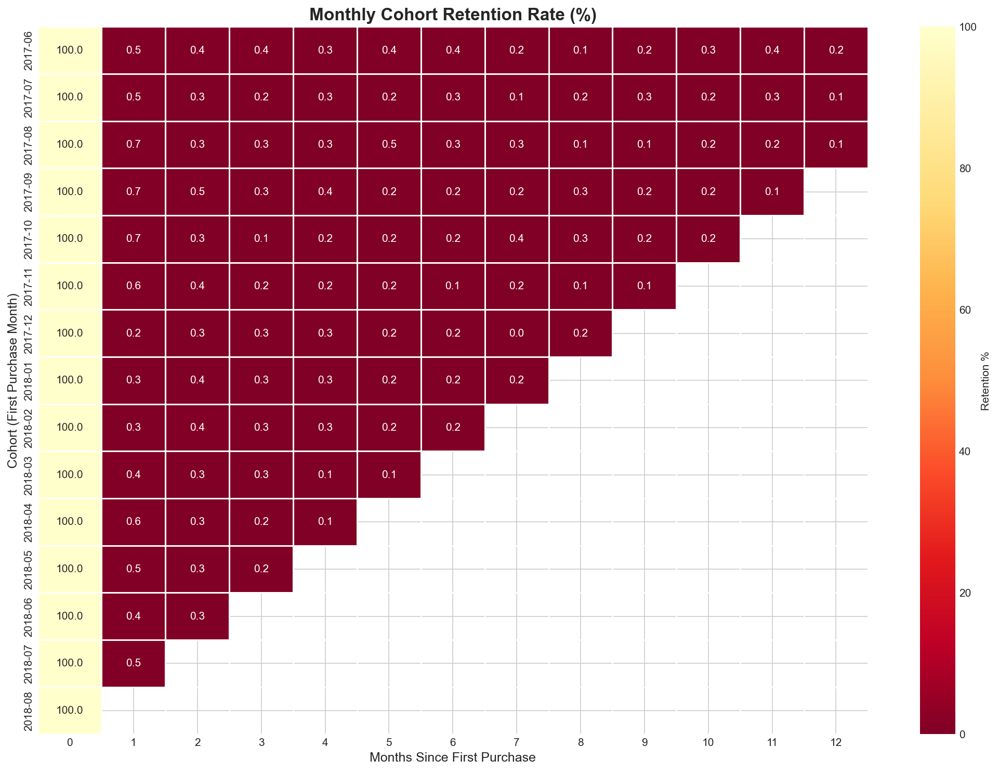
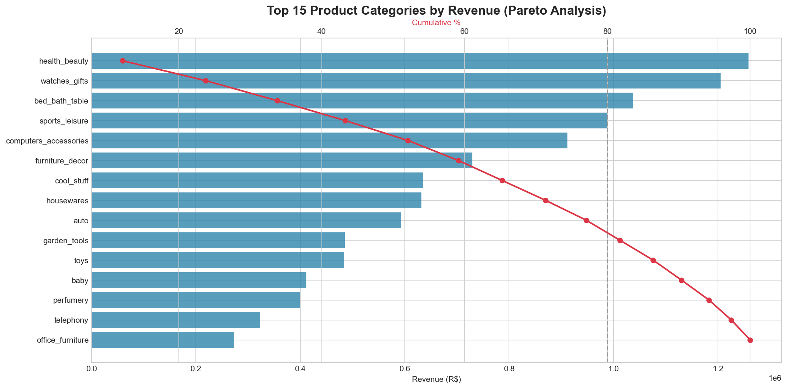
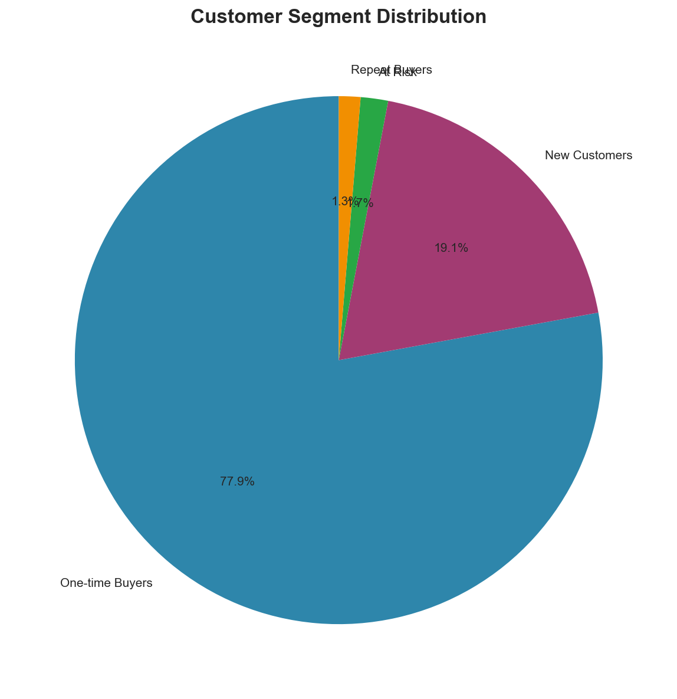

# Marketplace Growth & Retention Strategy
### An End-to-End Business Intelligence Analysis

**Uncovering why 97% of customers never return -- and quantifying the R$680K+ annual opportunity in fixing it.**



---

## Table of Contents
- [Project Overview](#project-overview)
- [Business Problem](#business-problem)
- [Data Source](#data-source)
- [Tools & Technologies](#tools--technologies)
- [Project Structure](#project-structure)
- [Key Findings](#key-findings)
- [Dashboard](#dashboard)
- [Recommendations](#recommendations)
- [How to Reproduce](#how-to-reproduce)
- [Author](#author)

---

## Project Overview

This project delivers a comprehensive business intelligence analysis of a Brazilian e-commerce marketplace, combining SQL data exploration, Python analytics, and Tableau visualization. The analysis uncovers critical insights about customer retention challenges, delivery performance impacts, and revenue concentration patterns -- providing actionable recommendations backed by quantified business impact.

**What I did:** Built an end-to-end BI pipeline from raw transactional data to executive-ready dashboards, including cohort analysis, RFM segmentation, and time series forecasting.

**Key insight:** Customer retention represents the largest growth opportunity, with only 3% repeat purchase rate and a quantified R$680K+ annual revenue impact from a 5% retention improvement.

---

## Business Problem

> A growing e-commerce marketplace is experiencing strong top-line growth but struggling with customer retention. Leadership needs to understand customer behavior, identify at-risk segments, and quantify the impact of operational issues on customer satisfaction.

**Specific questions addressed:**
1. What is our true customer retention rate, and how does it vary by cohort?
2. How do operational issues (late deliveries) impact customer satisfaction?
3. Which customer segments represent the highest value and highest risk?
4. What is the revenue impact of improving retention by 5%?
5. Can we forecast revenue to support resource planning?

---

## Data Source

| Attribute | Details |
|-----------|---------|
| **Dataset** | Brazilian E-Commerce Public Dataset by Olist |
| **Source** | [Kaggle](https://www.kaggle.com/datasets/olistbr/brazilian-ecommerce) |
| **Size** | 100K+ orders across 9 relational tables |
| **Period** | September 2016 - August 2018 |
| **Tables** | Orders, Order Items, Order Payments, Order Reviews, Products, Sellers, Customers, Geolocation, Category Translation |

---

## Tools & Technologies

| Tool | Purpose |
|------|---------|
| **SQL (SQLite)** | Data exploration, cohort queries, business metrics |
| **Python** | Data cleaning, EDA, segmentation, forecasting |
| **Pandas & NumPy** | Data manipulation and analysis |
| **Matplotlib & Seaborn** | Statistical visualizations |
| **Statsmodels** | Time series decomposition and Holt-Winters forecasting |
| **Tableau Public** | Interactive executive dashboard |
| **Git/GitHub** | Version control and portfolio presentation |

---

## Project Structure

```
marketplace-bi-analysis/
|
+-- data/
|   +-- raw/                    # Original Olist CSV files (9 tables)
|   +-- processed/              # Cleaned data, RFM scores, segments
|   +-- tableau_exports/        # Dashboard-ready aggregated data
|   +-- olist_ecommerce.db      # SQLite database
|
+-- sql/
|   +-- 01_create_tables.sql    # Schema creation and data loading
|   +-- 02_data_exploration.sql # Initial data profiling queries
|   +-- 03_business_queries.sql # KPI and cohort analysis queries
|
+-- notebooks/
|   +-- 01_data_cleaning.ipynb  # Data cleaning and RFM calculation
|   +-- 02_eda.ipynb            # Revenue analysis and trends
|   +-- 03_segmentation.ipynb   # RFM customer segmentation
|   +-- 04_churn_analysis.ipynb # Cohort retention analysis
|   +-- 05_forecasting.ipynb    # Time series revenue forecasting
|
+-- dashboards/
|   +-- tableau_spec.md         # Dashboard design specification
|   +-- README.md               # Dashboard documentation
|
+-- images/                     # Generated visualizations
+-- reports/                    # Executive summaries
+-- scripts/                    # Data export utilities
|
+-- requirements.txt            # Python dependencies
+-- README.md                   # This file
```

---

## Key Findings

### 1. Customer Retention is the Biggest Opportunity


**Finding:** Only **3% of customers make a repeat purchase**. Month-1 retention averages just 0.5-1%, indicating customers are not returning after their first order.

**Business Impact:**
- 97% of revenue comes from first-time purchasers
- Growth is entirely dependent on new customer acquisition
- A **5% improvement in retention = R$680K+ additional annual revenue**

---

### 2. Late Deliveries Destroy Customer Satisfaction

**Finding:** Orders delivered late show dramatically lower review scores:
- **On-time delivery:** Average rating of 4.3 stars
- **10+ days late:** Average rating of 1.88 stars

**Business Impact:**
- Late deliveries correlate with 1-star reviews
- Negative reviews damage marketplace reputation
- Delivery performance directly impacts customer willingness to return

---

### 3. Revenue is Highly Concentrated (Pareto Principle)



**Finding:**
- **Top 20% of product categories generate ~80% of revenue**
- Top categories: bed_bath_table, health_beauty, sports_leisure, furniture, computers
- **Sao Paulo alone accounts for ~40% of total revenue**

**Business Impact:**
- Focus inventory and seller recruitment on top categories
- Geographic expansion opportunity beyond Southeast Brazil

---

### 4. Customer Segments Reveal Actionable Groups



**RFM Segmentation Results:**

| Segment | % of Customers | Strategy |
|---------|---------------|----------|
| Champions | ~5% | Loyalty rewards, VIP treatment |
| Loyal Customers | ~8% | Upsell premium products |
| New Customers | ~25% | Onboarding, encourage second purchase |
| Potential Loyalists | ~15% | Nurture with personalized offers |
| At Risk | ~12% | Win-back campaigns |
| Hibernating | ~30% | Low-cost reactivation attempts |
| Need Attention | ~5% | Targeted research |

---

### 5. Revenue Growth Shows Seasonal Patterns


**Finding:**
- Strong upward growth trajectory from 2017-2018
- Clear Q4 seasonality (Black Friday, holiday shopping)
- Holt-Winters forecasting achieves reasonable MAPE for 8-week predictions

---

## Dashboard

**[View Interactive Dashboard on Tableau Public](#)** *(Link to be added after publishing)*

The 4-page Tableau dashboard includes:

1. **Executive Overview** - Revenue trends, KPIs, geographic distribution
2. **Customer Intelligence** - Segments, cohort retention, CLV metrics
3. **Operations & Satisfaction** - Delivery performance, review analysis
4. **Seller Scorecard** - Seller rankings and performance metrics

---

## Recommendations

| Priority | Recommendation | Expected Impact |
|----------|---------------|-----------------|
| **High** | Implement customer loyalty/rewards program | +5% retention = R$680K annual revenue |
| **High** | Improve delivery performance and set accurate expectations | Higher satisfaction, reduced negative reviews |
| **Medium** | Launch post-purchase email remarketing campaign | Increase repeat purchase rate |
| **Medium** | Focus seller recruitment on top 10 revenue categories | Improve selection in high-demand areas |
| **Medium** | Develop targeted win-back campaigns for "At Risk" segment | Recover churning customers |
| **Low** | Expand marketing to Northeast and Central-West regions | Geographic diversification |

---

## How to Reproduce

### Prerequisites
- Python 3.9+
- SQLite
- Jupyter Notebook

### Steps

1. **Clone this repository**
   ```bash
   git clone https://github.com/PhunsokNorboo/End-to-End-E-Commerce-Business-Intelligence-Analysis.git
   cd End-to-End-E-Commerce-Business-Intelligence-Analysis
   ```

2. **Install dependencies**
   ```bash
   pip install -r requirements.txt
   ```

3. **Download the dataset**
   - Download from [Kaggle](https://www.kaggle.com/datasets/olistbr/brazilian-ecommerce)
   - Extract CSV files to `data/raw/`
   - Or use the provided SQLite database (`data/olist_ecommerce.db`)

4. **Run notebooks in order**
   ```bash
   jupyter notebook
   ```
   Execute notebooks 01-05 sequentially. This will:
   - Clean and transform the raw data
   - Generate all visualizations in `images/`
   - Create processed datasets for Tableau

5. **View Tableau dashboard**
   - Open Tableau Public Desktop
   - Connect to CSV files in `data/tableau_exports/`
   - Build visualizations per `dashboards/tableau_spec.md`

---

## Author

**Phunsok Norboo**

- GitHub: [github.com/PhunsokNorboo](https://github.com/PhunsokNorboo)

---

*This project was completed as a portfolio piece demonstrating end-to-end business intelligence skills including SQL, Python, and data visualization.*

---

### Acknowledgments

- Dataset provided by [Olist](https://olist.com/) via Kaggle
- Analysis methodology inspired by industry best practices in e-commerce analytics
